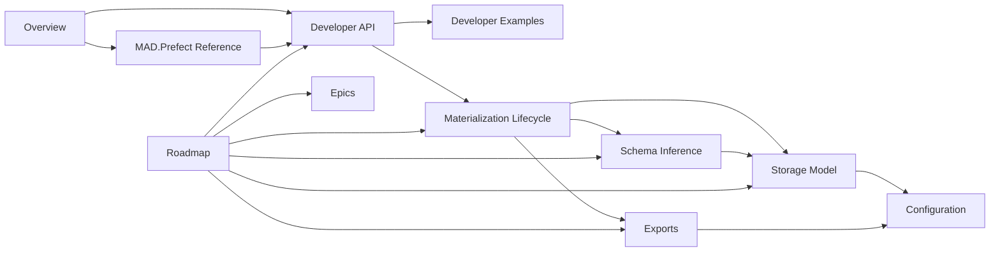

# Assquack Documentation

Assquack is a standalone DuckDB-native data asset library. These documents split
the architecture into focused zones so each topic has one owner.

## Architecture

- [Overview](overview.md): what Assquack is, what it is not, and the design
  philosophy.
- [Developer API](developer-api.md): the public Python contract for assets,
  queries, caching, arguments, and accepted inputs.
- [Materialization Lifecycle](materialization-lifecycle.md): what happens when
  an asset runs.
- [Schema Inference](schema-inference.md): continuous deep inference for
  inconsistent API payloads.
- [Storage Model](storage-model.md): DuckDB files, system tables, staging
  tables, locks, and future shared storage.
- [Exports](exports.md): export aliases, file types, ADLS/ABFSS, and
  compatibility artifacts.
- [Configuration](configuration.md): environment variables, Pydantic config,
  optional Hydra adaptation, and DuckDB settings.
- [MAD.Prefect Reference](mad-prefect-reference.md): historical/migration
  reference only. Assquack core does not depend on Prefect.
- [Roadmap](roadmap.md): MVP phases, acceptance criteria, open decisions, and
  later exploration.
- [Epics](epics/README.md): operational phase tracking for implementation
  work.

## Knowledge Map

Use the map as a reading path: start with [Overview](overview.md), then follow
the topic links that match the work in front of you.

## Examples

- [Developer Examples](developer-examples.md): concise usage examples for the
  path-first API.

## Research

- [Ingestion benchmarks](../benchmarks/ingestion/README.md): reproducible fixtures,
  pinned setup and actual MAD.Prefect comparisons for storage research.

## Historical Pointer

- [Original MVP Plan Archive](assquack-mvp-plan.md): retained as the original
  monolithic planning note for history.

## Implementation Tracking

- [Epics](epics/README.md): phase files with status headers, checklists, and
  validation notes.
